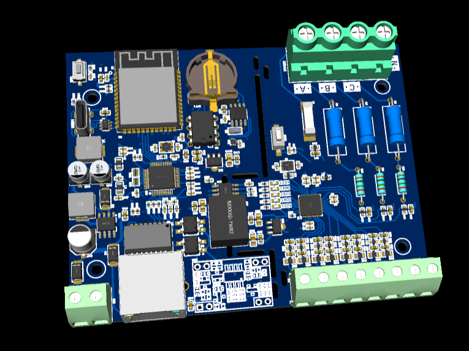
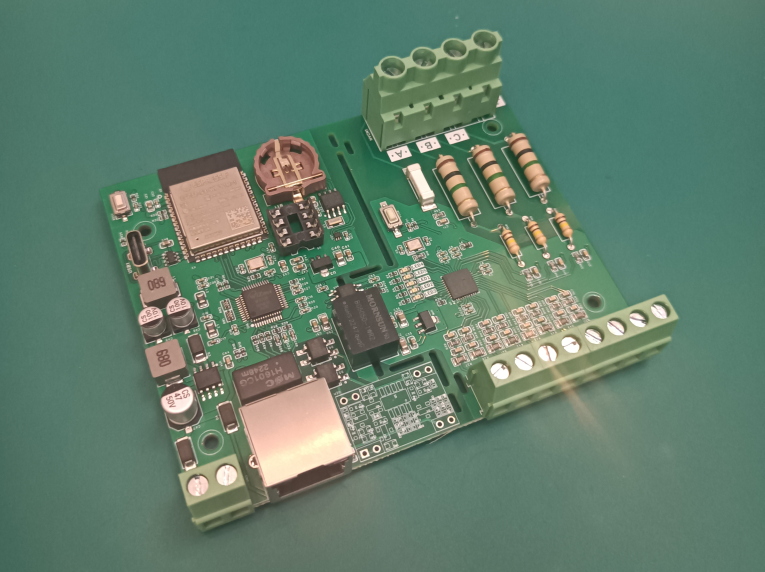

# PCBCrew ™ BLDGOT kWh

Poly-phase (3-phase and single-phase) power meter with ESP32, PoE, and ADE7878/ADE7880.

| 3D Preview                                                   | PCBA                                                     |
| ------------------------------------------------------------ | -------------------------------------------------------- |
|  |  |

* ADE7854/7858/7868/7878/7880 poly-phase energy metering AFE
* ESP32-S3
* Wiznet W5500 Ethernet Controller
* DP9905 PoE module
* DS1337 RTC and CR1220 battery holder
* DIP8 connector for 24Cxx EEPROM
* USB 2.0 Type-C connector for debugging

## Pin Assignments

### On-board peripherals

| Device          | Net name  | ESP32-S3 |
| --------------- | --------- | -------- |
| I2C SCL         | SCL       | GPIO_5   |
| I2C SDA         | SDA       | GPIO_4   |

### W5500 Ethernet controller

| W5500 | Net name   | ESP32-S3 |
| ----- | ---------- | -------- |
| SCLK  | SPI2_SCK   | GPIO_12  |
| MOSI  | SPI2_MOSI  | GPIO_11  |
| MISO  | SPI2_MISO  | GPIO_13  |
| SCSn  | SPI2_CS0   | GPIO_10  |
| RSTn  | SPI2_RESET | GPIO_47  |
| INTn  | SPI2_INT   | GPIO_48  |

### Project Ownership

This repository is hosted to the PCB desiber([DumTux](https://github.com/dumtux))'s GitHub account for backup.
The copyright of this hardware design is owned by [BUILDING OPTIMIZATION TECHNOLOGIES ™][bldgot].

### Sponsors:

* [BUILDING OPTIMIZATION TECHNOLOGIES ™][bldgot]
* [PCBCrew ™][pcbcrew]

---

[pcbcrew]: https://pcbcrew.com
[bldgot]: https://www.bldgot.com
